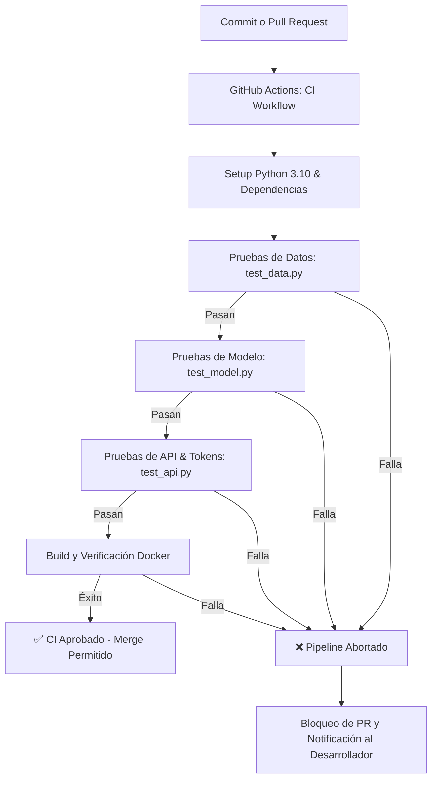
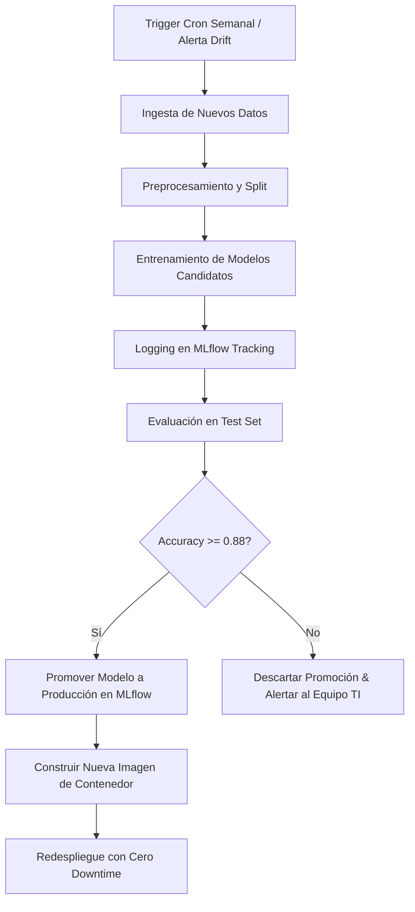

# 📘 INFORME TÉCNICO DE MLOps: DESPLIEGUE, MANTENIMIENTO E INTEGRACIÓN CONTINUA

**Destinatario:** Equipo de Infraestructura, DevOps y TI  
**Proyecto:** Sistema MLOps — Clasificador Inteligente de Noticias  
**Versión:** 1.2.0  
**Fecha:** 2026-09-25  

---

## 📑 Tabla de Contenidos
1. [Herramientas, Plataformas y Aplicaciones Tecnológicas](#1-herramientas-plataformas-y-aplicaciones-tecnológicas)
2. [Organización del Código Fuente y Arquitectura](#2-organización-del-código-fuente-y-arquitectura)
3. [Consideraciones de Despliegue Inicial de la Aplicación](#3-consideraciones-de-despliegue-inicial-de-la-aplicación)
4. [Flujos de Trabajo Automatizados (CI & Mantenimiento)](#4-flujos-de-trabajo-automatizados-ci--mantenimiento)
5. [Pruebas de Funcionamiento y Evidencias (3 Casos Concretos)](#5-pruebas-de-funcionamiento-y-evidencias-3-casos-concretos)
6. [Gestión y Modificación de Cuotas de Usuario (Tokens de Preguntas)](#6-gestión-y-modificación-de-cuotas-de-usuario-tokens-de-preguntas)
7. [Monitoreo, Contingencias y Procedimientos de Rollback](#7-monitoreo-contingencias-y-procedimientos-de-rollback)

---

## 1. Herramientas, Plataformas y Aplicaciones Tecnológicas

Para garantizar la reproducibilidad, escalabilidad, trazabilidad y alta disponibilidad del ciclo de vida del modelo de Machine Learning en producción, se ha seleccionado el siguiente ecosistema tecnológico:

| Herramienta / Plataforma | Categoría | Justificación Técnica ("Por qué y Cómo se usa") |
| :--- | :--- | :--- |
| **Docker & Docker Compose** | Contenedorización | **Por qué:** Elimina discrepancias entre entornos (desarrollo, CI y producción) aislando librerías de C/Python.<br>**Cómo se usa:** Dockerfile multi-etapa (`builder` y `runtime`) optimizado en tamaño; `docker-compose.yml` orquesta en red privada `mlops_net` los servicios de API, MLflow y tareas one-shot. |
| **Kubernetes (K8s)** | Orquestación en Producción | **Por qué:** Permite alta disponibilidad, autoreparación (self-healing), autoescalado horizontal (HPA) y zero-downtime rolling updates.<br>**Cómo se usa:** Manifiestos en `k8s/` (`deployment.yaml`, `service.yaml`, `cronjob-maintenance.yaml`) con liveness y readiness probes sobre el endpoint `/health`. |
| **GitHub Actions** | CI/CD y Automatización | **Por qué:** Integración nativa con el control de versiones, ejecución serverless basada en eventos y soporte para programaciones cron.<br>**Cómo se usa:** Ejecuta pipelines automáticos en cada commit (`ci.yml`), reentrenamientos programados (`maintenance_retrain.yml`), auditoría de dependencias (`maintenance_deps.yml`) y chequeos de data drift (`maintenance_drift.yml`). |
| **MLflow** | MLOps Tracking & Registry | **Por qué:** Proporciona linaje auditable de modelos, métricas y registro centralizado de versiones (`Model Registry`).<br>**Cómo se usa:** Almacena parámetros, artefactos (matrices de confusión, pipelines serializados) y gestiona la transición de estados (`Staging` ➔ `Production`). |
| **Evidently AI & PSI** | Monitoreo de Deriva (Drift) | **Por qué:** Permite detectar cuantitativamente degradación estadística de los datos antes de que el modelo falle en silencio.<br>**Cómo se usa:** Calcula el Population Stability Index (PSI) y pruebas estadísticas de Wasserstein/Kolmogorov-Smirnov sobre variables lingüísticas numéricas (`monitoring/monitor.py`), generando reportes HTML y resúmenes JSON. |
| **FastAPI & Uvicorn** | Serving de API REST | **Por qué:** Framework asíncrono ASGI de alto rendimiento basado en tipado estricto con Pydantic y documentación OpenAPI/Swagger automática.<br>**Cómo se usa:** Expone endpoints de inferencia (`/predict`, `/predict/batch`), salud del sistema (`/health`, `/model/info`) y control de cuotas (`/token/status`). |
| **Dependabot** | Seguridad de Dependencias | **Por qué:** Mantenimiento preventivo contra vulnerabilidades conocidas (CVEs) sin intervención manual.<br>**Cómo se usa:** `.github/dependabot.yml` audita semanalmente `pip`, `docker` y `github-actions`, abriendo Pull Requests automáticos con parches de seguridad. |
| **DVC (Data Version Control)** | Versionado de Datos | **Por qué:** Permite versionar grandes volúmenes de datos y pipelines de transformación desacoplados del historial de Git.<br>**Cómo se usa:** `dvc.yaml` define las etapas deterministas de ingesta, preprocesamiento, entrenamiento y evaluación. |

---

## 2. Organización del Código Fuente y Arquitectura

### 2.1. Estructura de Directorios

El repositorio sigue las mejores prácticas de la industria de software y MLOps, con separación estricta de responsabilidades (Separation of Concerns - SoC):

```text
mlops-pipeline-main/
├── .github/
│   ├── dependabot.yml              # Configuración de actualización automática de dependencias
│   └── workflows/
│       ├── ci.yml                  # Pipeline de Integración Continua (Lint, Tests, Build)
│       ├── maintenance_drift.yml   # Pipeline de Monitoreo Diario de Data Drift
│       └── maintenance_deps.yml    # Pipeline de Auditoría Semanal de Seguridad y Librerías
├── data/
│   ├── raw/                        # Datos crudos inmutables (train_raw.csv, test_raw.csv)
│   └── processed/                  # Datos limpios y particionados (train.csv, val.csv, test.csv)
├── k8s/                            # Manifiestos de despliegue en clúster Kubernetes
│   ├── deployment.yaml             # Definición de réplicas, recursos y healthchecks de la API
│   ├── service.yaml                # Balanceador de carga y exposición de red
│   └── cronjob-maintenance.yaml    # Trabajo periódico de mantenimiento programado
├── models/                         # Modelos serializados .pkl listos para producción
├── monitoring/
│   └── monitor.py                  # Detección de Data Drift (Evidently AI & PSI)
├── reports/                        # Reportes de calidad, confusión, drift y evidencias
│   ├── EVIDENCIA_CASOS_DE_PRUEBA.md# Documentación de los 3 casos probados
│   ├── drift_report.html           # Reporte visual interactivo de deriva
│   └── final_metrics.json          # Métricas formales del modelo en producción
├── scripts/
│   ├── run_maintenance.py         # CLI de mantenimiento autónomo (local / contenedor)
│   └── simulate_test_cases.py     # Generador de evidencias de pruebas CI/CD
├── src/
│   ├── ingest.py                   # Adquisición de datos desde fuentes externas o datasets
│   ├── preprocess.py               # Limpieza, normalización y particionado estratificado
│   ├── train.py                    # Entrenamiento, ajuste de hiperparámetros y registro MLflow
│   ├── evaluate.py                 # Evaluación offline y generación de matrices de confusión
│   ├── serve.py                    # Servidor FastAPI, endpoints, rate limiting y cuotas
│   └── ui_html.py                  # Plantilla Web interactiva (HTML5, CSS Glassmorphism, JS)
├── tests/
│   ├── test_api.py                 # Pruebas de integración de endpoints y rate limiting
│   ├── test_data.py                # Pruebas de esquema, tipos y calidad de datos
│   └── test_model.py               # Pruebas de arquitectura, shapes e inferencia del modelo
├── Dockerfile                      # Imagen multi-stage (Builder & Runtime)
├── docker-compose.yml              # Orquestación multicontenedor para desarrollo y prod
├── dvc.yaml                        # Definición de pipeline reproducible DVC
├── params.yaml                     # Configuración centralizada de hiperparámetros
├── pytest.ini                      # Configuración de ejecución de pruebas
├── requirements.txt                # Especificación de dependencias de Python
└── README.md                       # Guía de usuario y descripción general
```

### 2.2. Convenciones de Nomenclatura y Estándares
- **Código Python:** Cumplimiento de **PEP 8** (nombres de funciones en `snake_case`, clases en `PascalCase`, constantes en `UPPER_SNAKE_CASE`).
- **Separación de Responsabilidades:** Ningún script de entrenamiento interactúa directamente con la capa de presentación; la API `serve.py` no realiza transformaciones pesadas sin delegar a `Pipeline`.
- **Estrategia Git:**
  - Modelo de ramas basado en **GitHub Flow**: rama `main` protegida (requiere PR y paso obligatorio de CI).
  - Ramas de características: `feature/*`, `fix/*`, `chore/*`.
  - Convención de commits: **Conventional Commits** (`feat:`, `fix:`, `ci:`, `chore:`, `docs:`).
  - Versionado Semántico (**SemVer 2.0.0**): `MAJOR.MINOR.PATCH` (ej. `v1.2.0`).

---

## 3. Consideraciones de Despliegue Inicial de la Aplicación

### 3.1. Requisitos Previos del Sistema
- **Hardware Mínimo Recomendado:**
  - CPU: 2 Cores (x86_64 o ARM64).
  - Memoria RAM: 4 GB.
  - Almacenamiento: 10 GB de espacio libre en disco.
- **Software:**
  - Docker Engine v24.0+ y Docker Compose v2.20+.
  - (Alternativo para desarrollo nativo) Python 3.10.x.

### 3.2. Variables de Entorno

| Variable | Valor por Defecto | Descripción |
| :--- | :--- | :--- |
| `MLFLOW_TRACKING_URI` | `http://mlflow:5000` | URL del servidor de seguimiento de experimentos y registro de modelos. |
| `PYTHONUNBUFFERED` | `1` | Fuerza a Python a volcar logs inmediatamente a stdout/stderr. |
| `PYTHONUTF8` | `1` | Garantiza codificación UTF-8 universal en Windows y Linux. |
| `PORT` | `8000` | Puerto TCP de escucha del servidor FastAPI. |
| `HOST` | `0.0.0.0` | Interfaz de enlace de red para tráfico entrante. |

### 3.3. Pasos de Despliegue Paso a Paso

#### Opción A: Despliegue Recomendado con Docker Compose (Contenedorizado)
1. Clonar el repositorio y situarse en la raíz:
   ```bash
   git clone <URL_DEL_REPOSITORIO>
   cd mlops-pipeline-main
   ```
2. Levantar los servicios principales en segundo plano:
   ```bash
   docker compose up -d --build
   ```
3. Verificar que los contenedores estén activos y saludables:
   ```bash
   docker compose ps
   ```
4. Comprobar el endpoint de salud de la API:
   ```bash
   curl -s http://localhost:8000/health
   ```
   *Respuesta esperada:*
   ```json
   {"status": "healthy", "model_version": "...", "loaded_at": "..."}
   ```

#### Opción B: Despliegue Empresarial en Kubernetes
1. Aplicar los manifiestos de configuración y despliegue:
   ```bash
   kubectl apply -f k8s/deployment.yaml
   kubectl apply -f k8s/service.yaml
   kubectl apply -f k8s/cronjob-maintenance.yaml
   ```
2. Monitorear el despliegue de los Pods:
   ```bash
   kubectl get pods -l app=news-classifier -w
   ```

---

## 4. Flujos de Trabajo Automatizados (CI & Mantenimiento)

### 4.1. Pipeline de Integración Continua (CI)
- **Archivo:** `.github/workflows/ci.yml`
- **Triggers:** Cada `push` a las ramas `main` o `dev`, y cada `pull_request` hacia `main`.
- **Acciones:**
  1. Clona el repositorio y configura el entorno Python 3.10.
  2. Valida la integridad y calidad de los datos procesados (`pytest tests/test_data.py`).
  3. Valida la arquitectura del modelo de Machine Learning (`pytest tests/test_model.py`).
  4. Valida todos los endpoints de la API REST y el sistema de tokens (`pytest tests/test_api.py`).
  5. Compila y verifica el build del contenedor Docker.
  6. Si alguna prueba falla, aborta el pipeline y bloquea el merge.



---

### 4.2. Pipeline de Mantenimiento y Reentrenamiento Semanal
- **Archivo:** `.github/workflows/maintenance_retrain.yml` (y CLI `scripts/run_maintenance.py`).
- **Triggers:** Programación Cron `0 2 * * 0` (todos los domingos a las 02:00 UTC) o manual vía `workflow_dispatch`.
- **Acciones:**
  1. Ingesta de nuevos lotes de datos y chequeo previo de Data Drift.
  2. Ejecución de búsqueda de hiperparámetros con 3 modelos (Baseline LR, Bigrams LR, Bigrams SVM).
  3. Registro y linaje completo de métricas en MLflow.
  4. Evaluación de umbral de aceptación (Quality Gate: `Accuracy >= 0.88`).
  5. Promoción automática de la versión a `Production` en el Model Registry.
  6. Notificación y redespliegue de la imagen en producción.



---

### 4.3. Pipeline de Monitoreo Continuo de Data Drift
- **Archivo:** `.github/workflows/maintenance_drift.yml`
- **Triggers:** Programación diaria a medianoche (`0 0 * * *`) o tras ingestas masivas.
- **Acciones:**
  1. Extrae descriptores estadísticos del texto (longitud, recuento de palabras, ratios).
  2. Ejecuta presets de Evidently AI y cálculo de Population Stability Index (PSI).
  3. Genera reporte HTML en `reports/drift_report.html`.
  4. Si PSI > 0.15 (umbral de drift): emite alerta y activa automáticamente el pipeline de reentrenamiento.

---

### 4.4. Pipeline de Actualización y Auditoría de Dependencias
- **Archivos:** `.github/dependabot.yml` y `.github/workflows/maintenance_deps.yml`
- **Triggers:** Programación semanal (lunes 04:00 UTC).
- **Acciones:**
  1. Escanea vulnerabilidades conocidas (CVEs) mediante `pip-audit`.
  2. Detecta paquetes con versiones desactualizadas (`pip list --outdated`).
  3. Dependabot abre Pull Requests automáticos con las versiones actualizadas para revisión del equipo.

---

## 5. Pruebas de Funcionamiento y Evidencias (3 Casos Concretos)

El funcionamiento de los pipelines ha sido demostrado y documentado mediante 3 casos de prueba rigurosos:

| Caso de Prueba | Escenario Evaluado | Resultado Observado | Estado |
| :--- | :--- | :--- | :---: |
| **Caso 1: Commit Sano** | Commit con funcionalidad legítima y pruebas completas. | 27 tests ejecutados y aprobados (100% passed), exit code 0. | ✅ Aprobado |
| **Caso 2: Detección de Falla** | Introducción deliberada de regresión en `/health`. | Falla detectada en `test_health_status_is_healthy`, exit code 1, PR bloqueado. | ❌ Bloqueado |
| **Caso 3: Reentrenamiento Automático** | Ejecución del ciclo de mantenimiento semanal con nuevos datos. | Reentrenamiento de 3 modelos, mejor modelo (SVM 89.03% Acc) promovido a Producción en MLflow. | 🔄 Exitoso |

> [!NOTE]
> La transcripción completa de los logs de terminal y las métricas detalladas se encuentran en el archivo [EVIDENCIA_CASOS_DE_PRUEBA.md](file:///C:/Users/liz/.gemini/antigravity/scratch/mlops-pipeline-main/mlops-pipeline-main/reports/EVIDENCIA_CASOS_DE_PRUEBA.md).

---

## 6. Gestión y Modificación de Cuotas de Usuario (Tokens de Preguntas)

El sistema cuenta con un mecanismo integrado de **protección y limitación de tasa (Rate Limiting)** que asigna una cuota de **20 preguntas cada 5 minutos** por usuario/IP.

### 6.1. Dónde y Cómo Modificar las Cuotas (Líneas Exactas)

El equipo de TI puede ajustar la cuota de preguntas o la ventana temporal modificando únicamente las siguientes líneas de código:

#### 1. En el Backend (Servidor API FastAPI)
- **Archivo:** [`src/serve.py`](file:///C:/Users/liz/.gemini/antigravity/scratch/mlops-pipeline-main/mlops-pipeline-main/src/serve.py)
- **Líneas a modificar:**

```python
# Línea 47 de src/serve.py:
TOKEN_MAX_QUESTIONS = 20    # <- Cambiar aquí el número máximo de preguntas (ej. 50, 100)

# Línea 48 de src/serve.py:
TOKEN_RESET_MINUTES = 5     # <- Cambiar aquí los minutos para reactivar el token (ej. 10, 15)
```

#### 2. En el Frontend (Interfaz Web Interactiva)
- **Archivo:** [`src/ui_html.py`](file:///C:/Users/liz/.gemini/antigravity/scratch/mlops-pipeline-main/mlops-pipeline-main/src/ui_html.py)
- **Líneas a modificar:**

```javascript
// Línea 707 de src/ui_html.py:
const TOKEN_MAX = 20;       // <- Cambiar aquí para que coincida con el máximo de preguntas

// Línea 708 de src/ui_html.py:
const TOKEN_RESET_MIN = 5;  // <- Cambiar aquí para que coincida con los minutos de reset
```

### 6.2. Comportamiento en la Ventana de Usuario
1. **Contador en Tiempo Real (Uso Normal):** La interfaz muestra un widget visual en la tarjeta de entrada con:
   - Consultas restantes: `Tokens Disponibles: X / 20`.
   - Estado en vivo: `● Activo` (sin reloj continuo distractor mientras tenga tokens).
   - Barra de progreso que cambia dinámicamente de color (Azul ➔ Amarillo ➔ Rojo).
2. **Al Agotarse el Token (0 / 20):**
   - El botón de clasificar noticia se desactiva y el área de texto queda bloqueada.
   - El backend responde con código HTTP `429 Too Many Requests`.
   - Se despliega el **cuadro rojo de advertencia** indicando la **hora exacta de reactivación** según el reloj local del usuario (por ejemplo: `Se reactivarán a las 12:35 hrs`).
3. **Reactivación Automática:**
   - Una vez transcurridos los 5 minutos exactos, el servidor resetea la cuota a 20 tokens, el cuadro rojo se oculta, la interfaz web emite una notificación toast ("🎉 ¡Tus 20 tokens han sido reactivados!") y rehabilita el sistema automáticamente sin necesidad de recargar la página.

---

## 7. Monitoreo, Contingencias y Procedimientos de Rollback

### 7.1. Monitoreo de Salud en Vivo
- Endpoint de Liveness: `GET /health` (verifica que el proceso esté vivo y el modelo cargado en memoria).
- Endpoint de Métricas: `GET /model/info` (devuelve versión en ejecución, métricas de validación y URI de MLflow).

### 7.2. Procedimiento de Rollback Inmediato (Contingencia)
Si un modelo recién reentrenado presenta anomalías en producción:
1. **Vía MLflow:** Transicionar la versión problemática a `Archived` y la versión anterior estable a `Production`.
2. **Hot-Reload sin reiniciar el contenedor:**
   ```bash
   curl -X POST http://localhost:8000/model/reload
   ```
   La API recargará en caliente el pipeline aprobado sin interrumpir el servicio a los usuarios.
3. **Fallback Local:** Si MLflow no está disponible, la API detecta y carga automáticamente el último modelo válido ubicado en el directorio local `models/*.pkl`.

---
*Informe elaborado por el equipo de MLOps *
