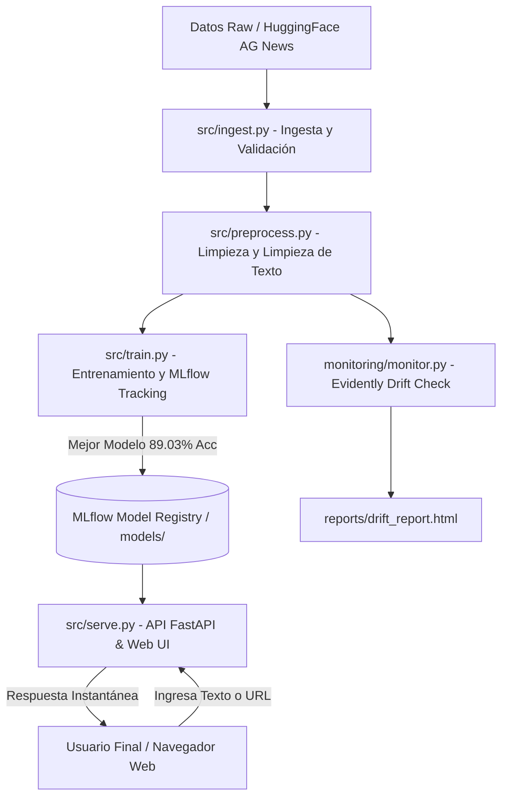

# 📰 MLOps Pipeline — Clasificador Inteligente de Noticias

Sistema completo de **MLOps (Machine Learning Operations)** para la ingesta, entrenamiento, seguimiento de experimentos, registro de modelos y despliegue en producción de un **Clasificador de Noticias con IA**.

El sistema incluye una **Interfaz Web Interactiva** diseñada para el usuario final, soporte multilingüe (Español e Inglés), extracción automática de texto desde enlaces web (URLs), registro de modelos con **MLflow** y monitoreo de deriva de datos con **Evidently**.

---

## 🚀 Inicio Rápido con Docker

El proyecto está 100% contenedorizado con **Docker Compose**.

### 1. Iniciar los Servicios
Para compilar y ejecutar todo el sistema (Servidor de MLflow y Servidor de Predicción API con la Interfaz Web):

```bash
docker compose up -d --build
```

### 2. Ejecutar la Pipeline de Entrenamiento (Opcional)
Para ejecutar la ingesta de datos, preprocesamiento, búsqueda de hiperparámetros y registro del mejor modelo en MLflow:

```bash
docker compose --profile train up --build train
```

### 3. Ejecutar el Monitoreo de Deriva de Datos (Data Drift)
Para evaluar la calidad de los datos y generar el informe de deriva:

```bash
docker compose --profile monitor up --build monitor
```

---

## 🌐 Servicios Disponibles

| Servicio | URL | Descripción |
| :--- | :--- | :--- |
| 🎨 **Interfaz Web Interactiva** | [http://localhost:8000](http://localhost:8000) | Portal interactivo para clasificar noticias por texto o enlace URL. |
| 📊 **MLflow Dashboard** | [http://localhost:5000](http://localhost:5000) | Panel de control de experimentos, métricas y registro de modelos. |
| ⚡ **Documentación API (Swagger)** | [http://localhost:8000/docs](http://localhost:8000/docs) | Documentación de la API FastAPI y pruebas de endpoints. |

---

## 🏛️ Arquitectura del Sistema



---

## 🏷️ Categorías Reconocidas por el Modelo

El modelo clasifica automáticamente cualquier texto o enlace en las siguientes **4 categorías**:

1. 🌐 **Mundo y Política Global** (`World`)
2. ⚽ **Deportes** (`Sports`)
3. 📈 **Economía y Negocios** (`Business`)
4. 💻 **Tecnología y Ciencia** (`Sci/Tech`)

---

## ✨ Características Destacadas para el Usuario Final

- 🔗 **Extracción desde URLs:** Pega el enlace de cualquier portal de noticias (ej: BBC, CNN, El País) y la IA descargará y analizará el contenido automáticamente.
- 🇪🇸 **Soporte Multilingüe:** Procesa textos tanto en **español** como en **inglés** con alta precisión.
- 🎯 **Visualización de Probabilidades:** Barras animadas con el desglose porcentual de certeza para cada categoría.
- 📋 **Herramientas de Copiado y Feedback:** Botón de un solo clic para copiar resultados y calificar la precisión.

---

## 📊 Métricas del Modelo Entrenado

Durante la fase de experimentos, se compararon 3 arquitecturas:

| Experimento | Tipo de Modelo | Precisión Validación | Precisión Test | Estado MLflow |
| :--- | :--- | :---: | :---: | :---: |
| `tfidf_svm_bigrams` 🏆 | **TF-IDF + LinearSVC (Calibrado)** | **89.03%** | **87.88%** | **Promovido a Producción** |
| `tfidf_lr_bigrams` | TF-IDF + Logistic Regression | 88.91% | - | Registrado |
| `tfidf_lr_baseline` | TF-IDF + Logistic Regression | 88.55% | - | Registrado |

---

## 📁 Estructura del Proyecto

```text
mlops-pipeline-main/
├── Dockerfile              # Dockerfile de 2 etapas (Builder & Runtime)
├── docker-compose.yml      # Orquestación de servicios (mlflow, api, train, monitor)
├── params.yaml             # Configuración centralizada de hiperparámetros
├── requirements.txt        # Dependencias de Python
├── README.md               # Documentación general del repositorio
├── data/                   # Datasets raw y procesados (train, val, test)
├── models/                 # Modelos entrenados exportados en formato .pkl
├── reports/                # Informes de evaluación y reporte de data drift HTML
├── src/
│   ├── ingest.py           # Ingesta y validación de datos
│   ├── preprocess.py       # Preprocesamiento y split de datos
│   ├── train.py            # Entrenamiento, logging a MLflow y registro de modelo
│   ├── serve.py            # Servidor API FastAPI & Manejo de peticiones
│   └── ui_html.py          # Plantilla HTML/CSS/JS de la Interfaz Web Interactiva
└── monitoring/
    └── monitor.py          # Chequeo de Data Drift con Evidently y cálculo de PSI
```

---

## 🔧 Tecnologías Utilizadas

- **Lenguaje:** Python 3.10
- **Machine Learning:** Scikit-Learn (TF-IDF, LinearSVC, CalibratedClassifierCV, Logistic Regression)
- **MLOps & Tracking:** MLflow (Experiment Tracking & Model Registry)
- **Servidor Web & API:** FastAPI, Uvicorn, HTML5 / CSS3 (Glassmorphic Theme), JavaScript
- **Contenedorización:** Docker, Docker Compose
- **Monitoreo de Datos:** Evidently AI, PSI (Population Stability Index)
